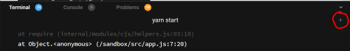
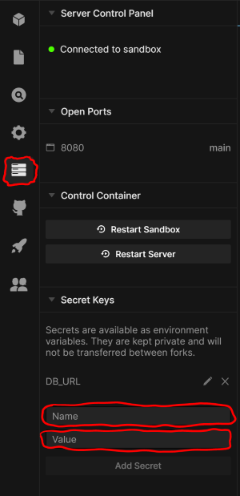

# Backend Interview Practice

```
You should only need to edit files in the `todo` folder
```

## Overview

This is a partial application that the student will complete to get all the tests passing

## Setup

- Open a new terminal and run `npm install`  
  
- Create a new database instance in [elephant sql](https://www.elephantsql.com/)
- Go into the `Server Control Panel` and add `DB_URL` and your `elephant sql url` to the name and value section.  
  
- Click the `Add Secret` button.
- Run the command `npm run migrate` to create the database tables. If prompted for a password, just press enter.
- run the command `npm t`
- You should see output from 10 integration tests, some will be failing.

## Exercise

Data is stored in the `todo` table. The table has the following columns:
| Column Name | Data Type |
| ----------- | --------- |
| id | integer |
| title | text |
| completed | boolean (default false) |

Expect POST and PUT requests to have a body with the following format:
```json
{
  "title": "string",
}
```

Completed will not be addressed in this exercise.

1. Add the **GET** (all) endpoint. expecting a array, status `200 if good`
2. Add the **POST** endpoint. expecting a object, status `201 if good`, and `400 if bad body`

3. Add the **GET** (single) endpoint. expecting a object, status `200 if good`, and `404 if bad id`
4. Add the **UPDATE** endpoint. expecting a object, status `200 if good`, and `404 if bad id`, `400 if bad body`
5. Add the **DELETE** endpoint. expecting a object, status `204 if good`, and `404 if bad id`

You have completed the task when all the unit tests pass.
